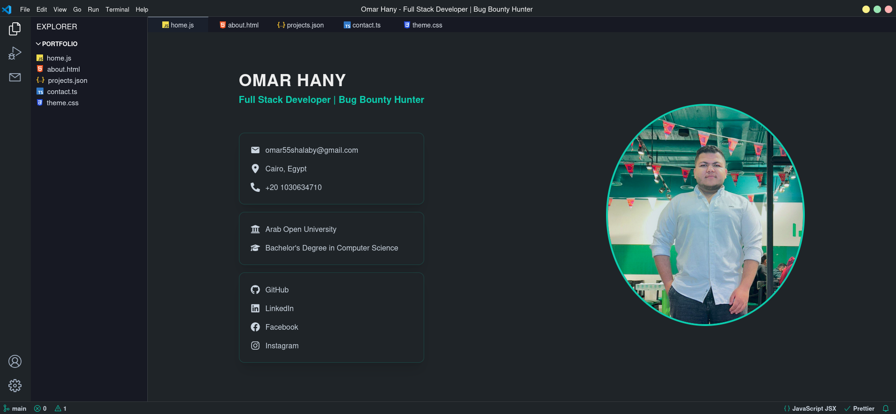

# Omar Hany's Portfolio with the Visual Studio Code Theme

## Table of Contents

- [Overview](#overview)
  - [Screenshot](#screenshot)
  - [Links](#links)
- [My Process](#my-process)
  - [Built With](#built-with)
- [How to Use](#how-to-use)
- [Make It Your Own](#make-it-your-own)
- [Deploy on Vercel](#deploy-on-vercel)
- [Use Your Own Email API](#use-your-own-email-api)
- [Author](#author)

---

## Overview

### Screenshot



### Links

- **Live Demo**: [https://omarhany.netlify.app](https://omarhany.netlify.app)
- **GitHub Repo**: [https://github.com/OmarHany-sudo/portfolio](https://github.com/OmarHany-sudo/portfolio)

---

## My Process

### Built With

- [Vite](https://vitejs.dev/) – Frontend build tool
- [React](https://reactjs.org/) – JavaScript library for building UIs
- [TypeScript](https://www.typescriptlang.org/) – Typed JavaScript
- [Chakra UI](https://chakra-ui.com/) – Component library for styling
- [EmailJS](https://www.emailjs.com/) – For sending contact emails
- [Framer Motion](https://www.framer.com/motion/) – For animations

---

## How to Use

1. **Fork** this repository to your GitHub account.
2. **Clone** the forked repository:

   ```bash
   git clone https://github.com/your-username/portfolio.git
   ```

3. Navigate to the project folder:

   ```bash
   cd portfolio
   ```

4. Install all dependencies:

   ```bash
   npm install
   ```

5. Start the development server:

   ```bash
   npm run dev
   ```

6. Open your browser and go to `http://localhost:5173` to view it locally.

---

## Make It Your Own

To customize this portfolio:

1. Navigate to `/public/data`.
2. Edit the `.ts` files to update:
   - Your bio
   - Skills
   - Projects
   - Social links
3. Restart the dev server:

   ```bash
   npm run dev
   ```

That’s it. No backend or complicated config required!

---

## Deploy on Vercel

Quick steps to deploy on Vercel:

1. Fork this repository.
2. Go to [https://vercel.com/new](https://vercel.com/new).
3. Connect your GitHub and import the forked repo.
4. Accept the default Vercel settings.
5. Hit **Deploy**, and you’re live!

---

## Use Your Own Email API

This project uses EmailJS for the contact form.

To set it up:

1. Create an account on [EmailJS](https://www.emailjs.com/).
2. Create an email template and get your:
   - **Service ID**
   - **Template ID**
   - **Public key**
3. Update these in `/src/utils/sendEmail.ts` accordingly:

   ```ts
   emailjs.send(
     SERVICE_ID,
     TEMPLATE_ID,
     templateParams,
     PUBLIC_KEY
   );
   ```

---

## Author

- 👨‍💻 **Website** – [Omar Hany](https://omarhany.netlify.app)
- 💼 **LinkedIn** – [@omar-hany-l850](https://www.linkedin.com/in/omar-hany-l850)
- 📘 **Facebook** – [@Omar.Hany.850](https://www.facebook.com/Omar.Hany.850)
- 📸 **Instagram** – [@omar.hany.850](https://www.instagram.com/omar.hany.850)